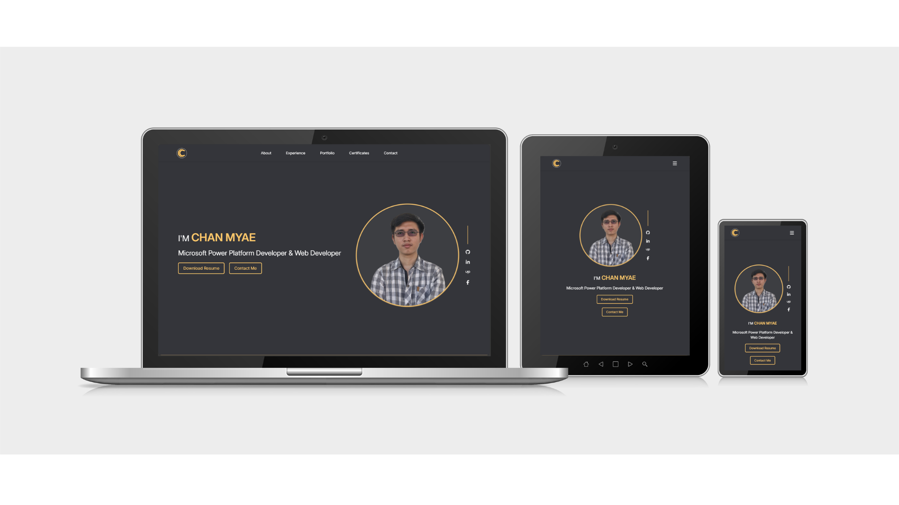

# [Chan Myae Aung] | Portfolio Website 🚀

A modern, responsive portfolio website built with **React**, **Tailwind CSS**, and **AOS**. This project showcases my work, skills, experience, projects, and provides a direct line of communication via an integrated contact form.

[View Live Demo](https://chanmyaeaung.netlify.app)

## 🛠️ Built With

- **React.js** - Frontend framework
- **Tailwind CSS** - Styling and layout
- **EmailJS** - Client-side email integration
- **React Toastify** - Toast notifications for form feedback
- **AOS (Animate On Scroll)** - Scroll animations
- **React Scroll** - Smooth navigation logic

## ✨ Key Features

- **Responsive Design:** Optimized for mobile, tablet, and desktop views.
- **Smooth Navigation:** Single-page architecture with sticky header and scroll spying.
- **Dynamic Animations:** Elements reveal gracefully as the user scrolls.
- **Functional Contact Form:** Real-time validation and automated email delivery.
- **Resume Integration:** Viewable in-browser and downloadable PDF.
- **Grid Layouts:** Optimized project gallery using CSS Grid and Flexbox.
